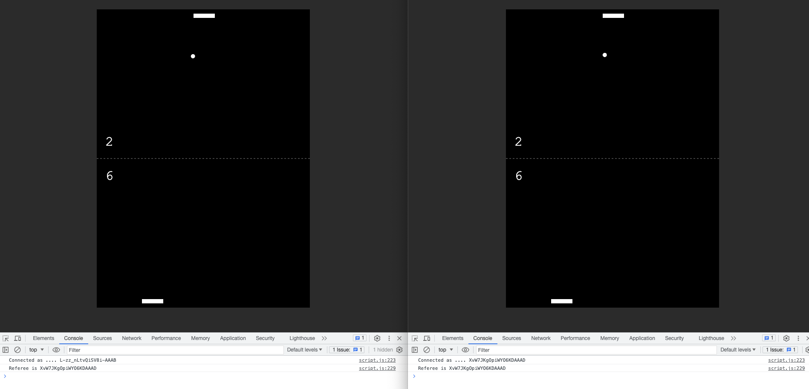
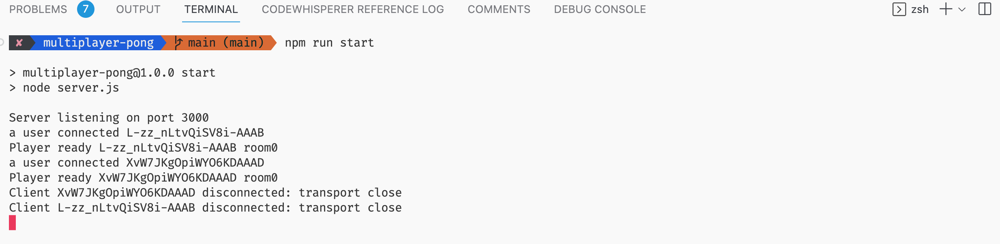
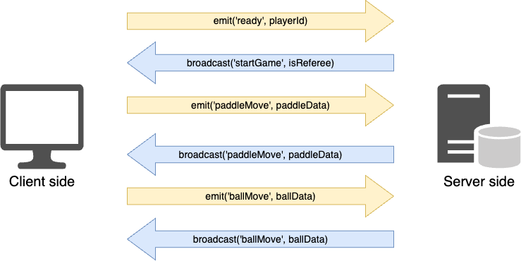

# Multiplay Pong game (with websocket in node.js)

## Introduction

This repo show how to implement the multiplayer pong game by Websocket. It use the package of *socket.io* to achieve the double channel communication and the server is built by node.js and express.

| |
|:--:|
| *The screenshot of multiplay pong game* |

On the server side, it can monitor how many tabs are connected to this URL, and display the room numbers that are paired with each other.

| |
|:--:|
| *The record of server side* |

### The thinking of two-way communication

Here are some things that have to notice when developing:

1. Game ready and start:
  To confirm two players are paired with each other and the secondary wil be referee to start the game.
2. The data of paddle moving:
  The client side always emit his paddle position and the server side will get and broadcast the other one's paddle position.
3. The data of ball moving:
  On the client side, it will emit the ball position and get it from the server side immediately.

| |
|:--:|
| *The design channel of socket* |

## Installation

1. Make sure you already environment of node.js and install express

     ```bash
     npm install
     npm install express
     ```

2. Install the package of socket.io

   ```bash
   npm install socket.io
   ```

3. Run the server and open <http://localhost:3000> in your browser

   ```bash
   npm run start
   ```

## Contributor

***Wen Su***
